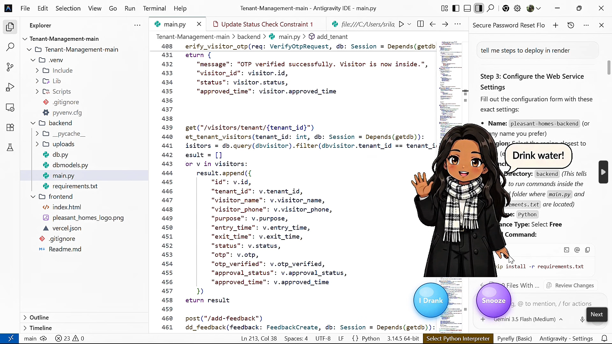

# 🌟 My Desktop Companion — Chrome Edition

An event-driven Chrome Extension (Manifest V3) that embeds an interactive wellness companion directly into your web-browsing workspace. Built to combat digital fatigue, this extension overlays a responsive companion on top of active web pages, using an asynchronous canvas engine to stream background-removed (chroma-key) video assets smoothly and without a visible bounding box.

---

## 🎬 Demo



*The companion overlays on top of any active window/tab, popping up with a "Drink water!" prompt and two quick actions — **I Drank** or **Snooze**.*

---

## 🔄 Project Evolution

This project is a complete architectural evolution of my original **Python Desktop Companion**.

The initial version was a native, local desktop client built with Python and PyQt5. For this iteration, I ported the entire core logic to a browser-native JavaScript ecosystem. This shift removes local installation friction entirely — the wellness companion now lives right inside the browser, with no separate app to install, run, or keep open in the background.

---

## ✨ Features

* **Web-Native Overlay** — Injects a dynamic, interactive companion directly into the active page's DOM, without disrupting the host site's layout.
* **Chroma-Key Canvas Engine** — Processes transparent video streams asynchronously via HTML5 Canvas, so the companion blends into the page with no visible background box.
* **Manifest V3 Architecture** — Built on Chrome's current extension standard, using a lightweight service worker for background execution instead of a persistent background page.
* **Configurable Reminders** — Set your own interval between hydration reminders.
* **Smart Snooze** — Snoozing for 5 or 10 minutes brings the reminder back at exactly that time, not the original interval.
* **Context-Aware Styling** — Fully scoped CSS keeps the companion's appearance isolated from the host website's styles.

---

## 🛠️ Tech Stack

* **Frontend Core:** JavaScript (ES6+), HTML5 Canvas, CSS3
* **Extension API:** Chrome Manifest V3 (Service Workers, Content Scripts)

### Directory Structure

```text
Companion_extension/
├── manifest.json       # Extension configuration & permission mappings
├── background.js       # Background service worker handling extension lifecycle
├── content.js           # DOM injection logic and chroma-key video canvas loop
├── styles.css            # Scoped presentation layout for the companion element
├── companion1.mp4      # Transparency-optimized video asset (idle state)
└── companion2.mp4      # Transparency-optimized video asset (talking/alert state)
```

---

## 🔐 Permissions

This extension requests the following permissions in `manifest.json`:

| Permission | Why it's needed |
|---|---|
| `activeTab` | To inject the companion overlay into the currently active tab |
| `scripting` | To run the content script that renders and animates the companion |
| `storage` | To save your reminder interval and snooze preferences locally |

No browsing data, page content, or personal information is collected, stored remotely, or sent anywhere. Everything runs and stays entirely on your device.

---

## 🚀 Installation & Setup

### Method 1: The Quick Installer (Recommended)

1. Go to the **[Releases page](https://github.com/Srilathika23/My-Desktop-Companion---Chrome-Extension/releases)** of this repository.
2. Download the `Companion_extension.crx` file from the latest release.
3. Open a new tab in Google Chrome and go to `chrome://extensions/`.
4. Enable **Developer mode** using the toggle in the top-right corner.
5. Drag and drop the downloaded `.crx` file anywhere onto that page to install.

### Method 2: Running from Source

1. Clone this repository or download it as a ZIP and extract it.
2. Open Chrome and go to `chrome://extensions/`.
3. Enable **Developer mode** using the toggle in the top-right corner.
4. Click **Load unpacked**.
5. Select the `Companion_extension` folder containing `manifest.json`.

💡 After installing either way, click the puzzle-piece icon next to your address bar and **pin** the extension for quick access.

---

## ⚠️ Known Limitations

* Not yet published on the Chrome Web Store — install manually via the steps above.
* Requires Developer Mode to be enabled in Chrome, since it isn't store-verified yet.
* Currently supports Chromium-based browsers only (Chrome, Edge, Brave).

---

## 🗺️ Roadmap

*  Chat bubbles with more personality and variety
*  Idle and waving animation states
*  Daily hydration goal tracking with a celebration animation
*  Publish to the Chrome Web Store

---

## 👩‍💻 Author

**Sri Lathika V S**
